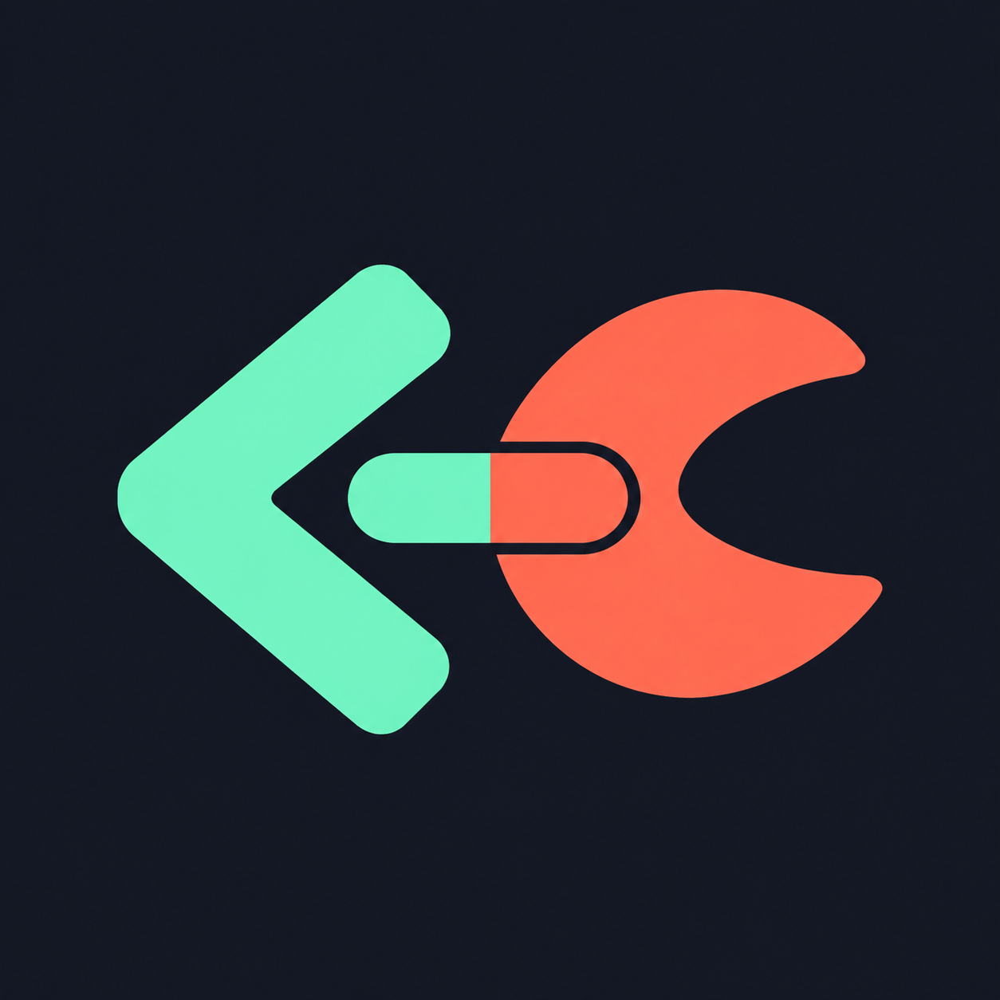

  

<h1 align="center">OpenClaw Bridge</h1>

<strong>Your coding agent. Your personal agent. One conversation away.</strong>

  <a href="docs/getting-started.md"><strong>Install in Codex →</strong></a> ·
  <a href="docs/workflows.md">Example workflows</a> ·
  <a href="docs/README.md">Documentation</a> ·
  <a href="https://github.com/pdurlej/codex-openclaw/tree/main/plugins/openclaw-bridge">Public plugin</a>

Open source · MIT · Local CLI or SSH · Your existing OpenClaw agent

Codex writes the code. Your OpenClaw agent brings its available context and preferences.
**The bridge lets them talk**, so you can debug, personalize, and test without
copy-pasting every question and answer between apps.

## What can you do with it?

| Debug together | Make it yours | Test with context |
| --- | --- | --- |
| Investigate unexpected behavior, compare examples, and follow up after a fix. | Build prompts, skills, and workflows around how you want your assistant to behave. | Ask your agent for edge cases and feedback on real test results. |

## A real feedback loop

We used the bridge to ask an OpenClaw agent to review this very README.

**Before:** “One conversation away” — but the setup still felt like a long checklist.
**Agent feedback:** make the first run four clear steps and explain what context the agent can see.
**After:** a four-step guide, a context note, and [the actual exchange with verification results](docs/real-example.md).

**Ask → collect feedback → improve → verify → follow up.**

Want to try it? Ask Codex: *“Consult this change with my OpenClaw agent and suggest three acceptance cases.”*

## Get started

Already running OpenClaw? **[Your first conversation in four steps →](docs/getting-started.md)**

Get the plugin → connect your agent → check and install → ask.
You need Codex with plugin support, Python 3.10+, and a working Gateway.

**What does your agent see?** The context Codex sends with the question, plus what
its own memory and tools can access. It does not automatically share your Codex
chat or see every channel and deployment. Choose what to send; verify the real
user path separately. [Context and privacy →](docs/reference.md#permissions-and-privacy)

v1 conversations start in Codex. Agent feedback complements real tests.
[How it works, permissions, and costs](docs/workflows.md#the-feedback-loop).

---

[Read the docs](docs/README.md) · [Report a bug or suggest an idea](https://github.com/pdurlej/codex-openclaw/issues) · [MIT license](LICENSE)
